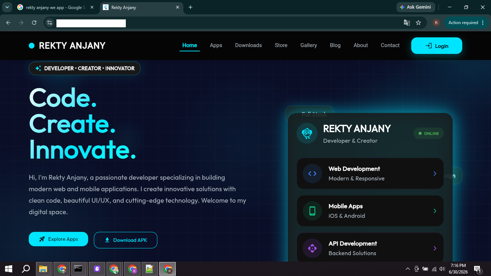
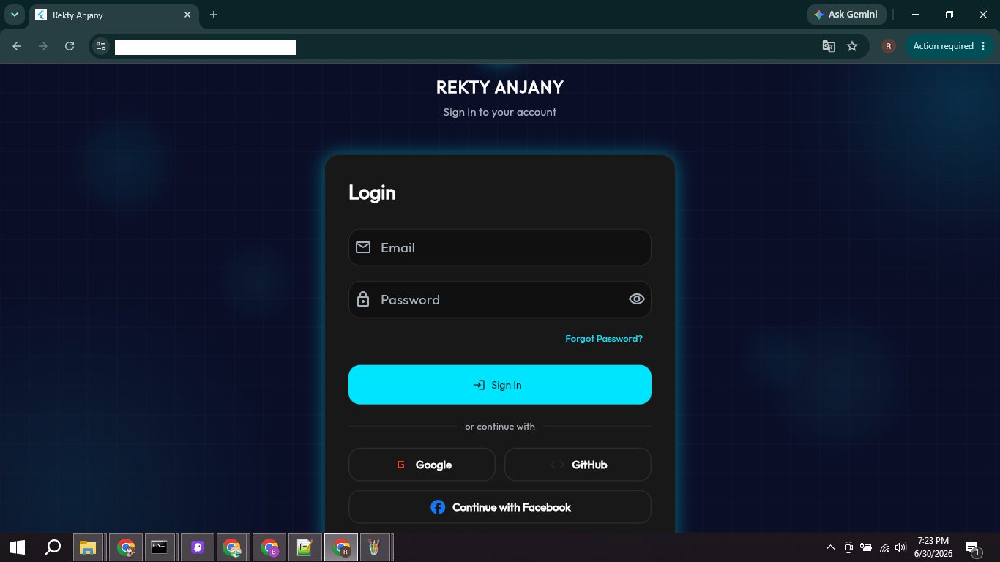
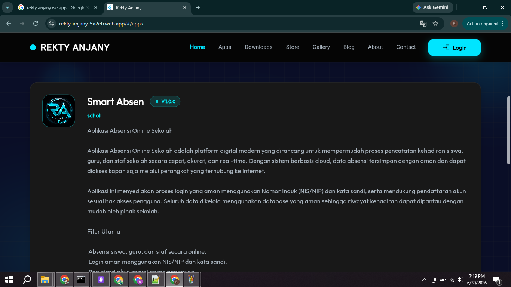
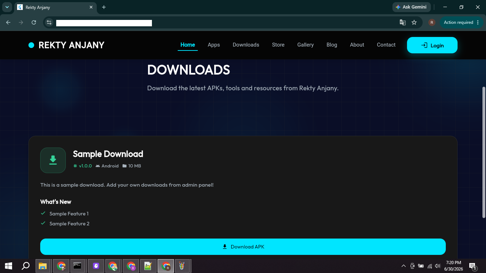
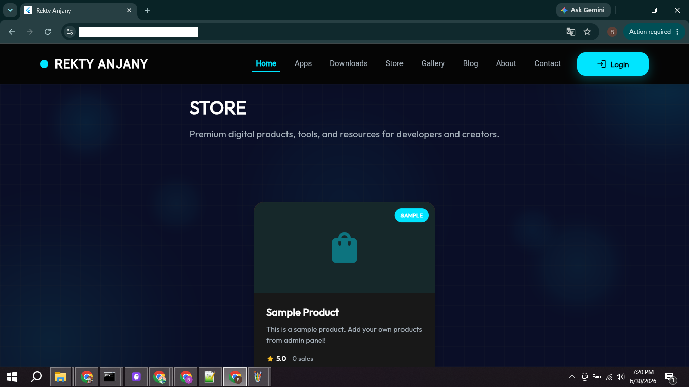
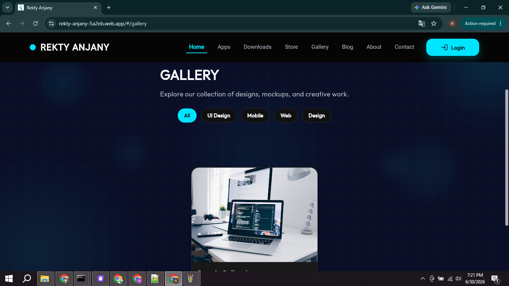
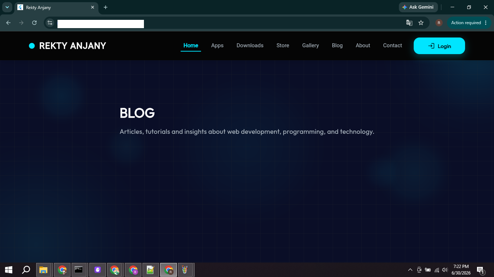
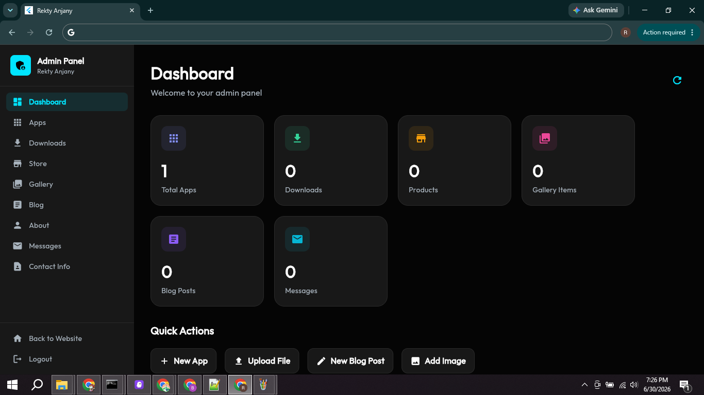
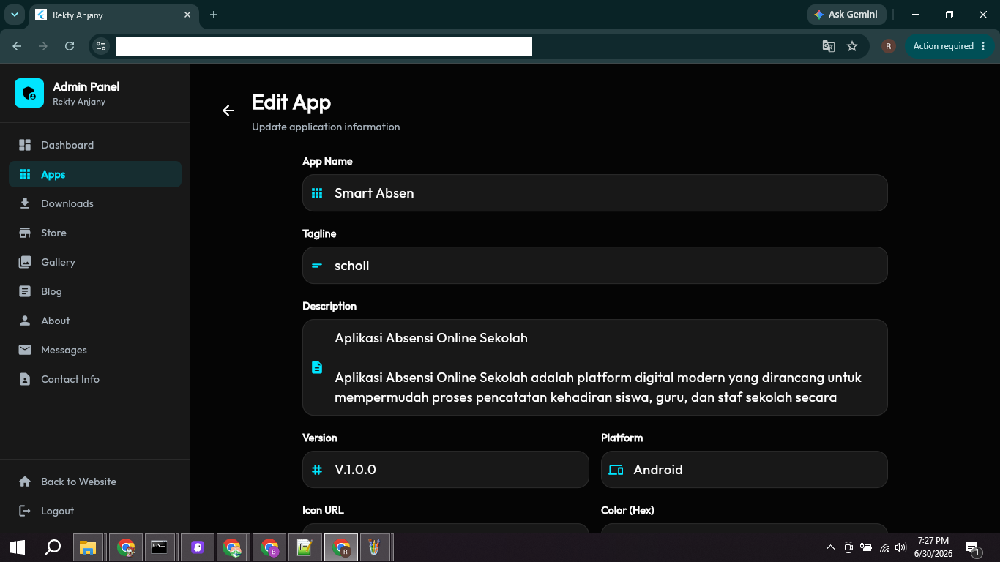

# Rekty Anjany Portfolio

A modern, full-stack portfolio website built with Flutter and Supabase, featuring a complete admin panel for content management.

## 🌐 Live Demo

**Website:** https://rekty-anjany-5a2eb.web.app

## 🔗 Repository

**GitHub:** https://github.com/rekty/REKTY-ANJANY

---

# 📸 Screenshots

### 🏠 Home

<p align="center">
  
</p>

---

### 🔐 Login

<p align="center">
  
</p>

---

### 📱 Applications

<p align="center">
  
</p>

---

### 📥 Downloads

<p align="center">
  
</p>

---

### 🛒 Store

<p align="center">
  
</p>

---

### 🖼️ Gallery

<p align="center">
  
</p>

---

### 📝 Blog

<p align="center">
  
</p>

---

### ⚙️ Admin Dashboard

<p align="center">
  
</p>

---

### 📊 Admin Management

<p align="center">
  
</p>

---

## ✨ Features

### Public Features

- 🏠 **Home** - Landing page with hero section
- 🤖 **AI Integration** - AI-powered features showcase
- 📱 **Apps** - Showcase of mobile/web applications
- 📥 **Downloads** - APK and resource downloads
- 🛒 **Store** - Digital products and tools
- 🖼️ **Gallery** - Project screenshots and designs
- 📝 **Blog** - Articles and tutorials
- 👤 **About** - Personal profile and skills
- 📧 **Contact** - Contact form and information

### Admin Panel Features

- 🔐 **Secure Authentication** - OAuth login (Google, GitHub, Facebook) + Email/Password
- 🛡️ **Role-Based Access Control** - Database-managed admin access
- 📊 **Dashboard** - Real-time statistics and analytics
- ✏️ **Content Management** - Full CRUD for all content types
- 🎨 **Custom Styling** - Dynamic colors and fonts per content
- 🖼️ **Image Upload** - Supabase Storage integration
- 📱 **Responsive Design** - Works on all devices
- 🔒 **Admin Protection** - Secure route middleware

> **Note:** Admin panel access is restricted. Contact the developer for admin credentials.

## 🛠️ Tech Stack
## 🛠️ Tech Stack

### Frontend

- **Flutter** - Cross-platform UI framework
- **Dart** - Programming language
- **go_router** - Declarative routing
- **http** - API communication

### Backend

- **Supabase** - Backend-as-a-Service
  - PostgreSQL Database
  - Row Level Security (RLS)
  - Authentication (OAuth + Email/Password)
  - OAuth Providers: Google ✅ GitHub ✅ Facebook ✅
  - Storage (File uploads)
  - RESTful API
  - Real-time subscriptions

### Hosting

- **Firebase Hosting** - Production deployment
- **GitHub** - Version control

---

# 🚀 Getting Started

## Prerequisites

- Flutter SDK (3.0 or higher)
- Dart SDK (3.0 or higher)
- Firebase CLI (optional)
- A Supabase account
- VS Code / Android Studio

---

## Installation

### 1. Clone Repository

```bash
git clone https://github.com/rekty/REKTY-ANJANY.git
cd REKTY-ANJANY
```

---

### 2. Install Dependencies

```bash
flutter pub get
```

---

### 3. Configure Supabase

Copy the example configuration file:

```bash
# Windows (CMD)
copy lib\core\config\supabase_config.example.dart lib\core\config\supabase_config.dart

# Linux/Mac
cp lib/core/config/supabase_config.example.dart lib/core/config/supabase_config.dart
```

Get your credentials from [Supabase Dashboard](https://app.supabase.com) → Project Settings → API

Update `lib/core/config/supabase_config.dart`:

```dart
class SupabaseConfig {
  static const String supabaseUrl = 'https://YOUR_PROJECT_ID.supabase.co';
  static const String supabaseAnonKey = 'YOUR_SUPABASE_ANON_KEY';
}
```

> **Security Note:** Never commit `supabase_config.dart` to Git. It's already in `.gitignore`.

---

### 4. Setup Database

Run the SQL schema in your Supabase SQL Editor:

1. Go to [Supabase Dashboard](https://app.supabase.com)
2. Select your project
3. Navigate to **SQL Editor**
4. Copy and run the contents of `supabase_schema.sql`

This will create all necessary tables with Row Level Security enabled.

---

### 5. Configure OAuth (Optional)

To enable OAuth login (Google, GitHub, Facebook):

1. Go to **Supabase Dashboard** → Authentication → Providers
2. Enable desired providers:
   - **Google OAuth** ✅
   - **GitHub OAuth** ✅
   - **Facebook OAuth** ✅
3. Add OAuth credentials from respective developer consoles
4. Set redirect URL to: `https://YOUR_SUPABASE_PROJECT.supabase.co/auth/v1/callback`

**Important:** Only add the Supabase callback URL to OAuth providers, not your website URL.

---

### 6. Admin Access

Admin access is managed through the database `admin_users` table.

> **Note:** For security reasons, admin setup instructions are not public. Contact the developer if you need admin access to your deployment.

For development/testing purposes only, you can manually add an admin user via Supabase SQL Editor:

```sql
-- Example (DO NOT use in production with real credentials)
INSERT INTO admin_users (email, role)
VALUES ('your.email@example.com', 'super_admin');
```

Then login at `/login` using:
- Email/Password authentication (if configured in Supabase Auth)
- OAuth (Google/GitHub/Facebook)

---

# 💻 Development

Run development server:

```bash
# Chrome
flutter run -d chrome

# Edge
flutter run -d edge

# With hot reload
flutter run -d chrome --web-port=8080
```

The app will be available at `http://localhost:8080` (or your specified port).

---

# 📦 Build

### Flutter Web (Production)

```bash
flutter build web --release
```

Build output: `build/web/`

### Android APK

```bash
flutter build apk --release
```

Output: `build/app/outputs/flutter-apk/app-release.apk`

### Android App Bundle (Google Play)

```bash
flutter build appbundle --release
```

Output: `build/app/outputs/bundle/release/app-release.aab`

---

# 🚀 Deployment

### Firebase Hosting

1. Install Firebase CLI:

```bash
npm install -g firebase-tools
```

2. Login to Firebase:

```bash
firebase login
```

3. Initialize Firebase in your project:

```bash
firebase init hosting
```

Select:
- Public directory: `build/web`
- Configure as single-page app: `Yes`
- Set up automatic builds with GitHub: `No` (optional)

4. Deploy:

```bash
# Build first
flutter build web --release

# Then deploy
firebase deploy --only hosting
```

Your site will be live at: `https://YOUR-PROJECT.web.app`

## 📁 Project Structure

## 📁 Project Structure

```text
lib/
├── app/
│   └── router.dart
├── core/
│   ├── config/
│   ├── constants/
│   ├── middleware/
│   └── services/
├── features/
│   ├── home/
│   ├── apps/
│   ├── downloads/
│   ├── store/
│   ├── gallery/
│   ├── blog/
│   ├── about/
│   ├── contact/
│   ├── auth/
│   ├── login/
│   └── admin/
└── shared/
    └── layout/
```

---

# 🗄️ Database Schema

The project uses the following tables in Supabase.

- `admin_users`
- `apps`
- `downloads`
- `products`
- `gallery_items`
- `blog_posts`
- `about_me`
- `contact_info`
- `contact_messages`
- `analytics`

See `supabase_schema.sql` for the complete database schema.

---

# 🔒 Security

## Credentials Protection

This repository is configured to never expose sensitive credentials:

### ✅ Protected Files (Not in Git)

- `lib/core/config/supabase_config.dart` - Supabase credentials
- `.env` files - Environment variables
- `*-firebase-adminsdk-*.json` - Firebase admin SDK
- `*.key`, `*.pem`, `*.p12` - Private keys
- Database passwords and admin credentials

### ✅ Example Files (Safe to Commit)

- `lib/core/config/supabase_config.example.dart` - Template file
- `.env.example` - Environment template
- Database schema without data

### 🔐 Admin Access

- Admin credentials are **NOT** stored in code
- Admin access is managed via database (`admin_users` table)
- Admin panel requires authentication via `/login`
- Contact developer for admin access inquiries

---

## Row Level Security (RLS)

All database tables are protected with Row Level Security:

- **Public Read:** Anyone can view published content
- **Admin Write:** Only authenticated admins can create/update/delete
- **JWT Validation:** All requests validated with Supabase JWT tokens
- **Role-Based:** Admin access verified against `admin_users` table

---

# 🎨 Customization

## Theme

Edit

```text
lib/core/constants/app_colors.dart
```

Example

```dart
class AppColors {
  static const primary = Color(0xFF54C5F8);
  static const background = Color(0xFF0B0E13);
}
```

---

## Content Management

All website content can be managed directly from the Admin Panel.

```
/admin
```

No manual source code editing is required after deployment.

---

# 📝 Environment Variables

Create a `.env` file (already ignored by Git).

```env
SUPABASE_URL=your_supabase_url

SUPABASE_ANON_KEY=your_anon_key
```

> **Note**
>
> This project currently uses
> `supabase_config.dart`
> instead of `.env` for easier Flutter integration.

---

# 📈 Features Overview

### Public Website

- Home
- Apps
- Downloads
- Store
- Gallery
- Blog
- About
- Contact
- AI Integration

### Admin Panel

- Dashboard
- Manage Apps
- Manage Downloads
- Manage Products
- Manage Gallery
- Manage Blog
- Manage About
- Manage Contact
- Manage Messages
- Authentication
- Image Upload
- Statistics

---

# ⚡ Performance

- Flutter Web
- Responsive Layout
- Firebase Hosting
- Supabase Backend
- Modern UI
- Clean Architecture
- Optimized Routing

---

## 🤝 Contributing
## 🤝 Contributing

Contributions are welcome!

If you'd like to contribute to this project:

1. Fork this repository.
2. Create a new feature branch.

```bash
git checkout -b feature/amazing-feature
```

3. Commit your changes.

```bash
git commit -m "Add amazing feature"
```

4. Push your branch.

```bash
git push origin feature/amazing-feature
```

5. Open a Pull Request.

---

# 📄 License

This project is licensed under the **MIT License**.

See the **LICENSE** file for more information.

---

# 👤 Author

## Rekty Anjany

Modern Flutter Developer

### 🌐 Website

https://rekty-anjany-5a2eb.web.app

### 💻 GitHub

https://github.com/rekty

### 📂 Repository

https://github.com/rekty/REKTY-ANJANY

### 📧 Email

rekty.anjany@gmail.com

---

# 🙏 Acknowledgments

Special thanks to

- Flutter Team
- Supabase Team
- Firebase Team
- Open Source Community

for providing amazing tools and services that make this project possible.

---

# 📞 Support

If you find a bug or have any suggestions, feel free to:

- Open an Issue
- Submit a Pull Request
- Contact via Email

Email

rekty.anjany@gmail.com

GitHub Issues

https://github.com/rekty/REKTY-ANJANY/issues

---

# 🔒 Security Notes

Before deploying to production:

- ✅ Never commit `supabase_config.dart` (already in `.gitignore`)
- ✅ Never expose Supabase Service Role Key (only use Anon Key)
- ✅ Enable Row Level Security (RLS) on all tables
- ✅ Always use HTTPS in production
- ✅ Keep Flutter and dependencies updated
- ✅ Use environment-specific configs
- ✅ Regularly backup your database
- ✅ Monitor Supabase logs for suspicious activity
- ✅ Rotate OAuth secrets periodically

**Admin Credentials:**
- Stored securely in Supabase database only
- Not exposed in source code or environment files
- Contact developer for admin access

---

# ⭐ Support This Project

If you like this project, please consider giving it a ⭐ on GitHub.

It helps the project grow and motivates future development.

---

# 🚀 Roadmap

Future planned features:

- ✅ OAuth Authentication (Google, GitHub, Facebook) - **COMPLETED**
- ✅ Clean URLs (SEO-friendly routing) - **COMPLETED**
- ✅ Dynamic Content Styling - **COMPLETED**
- 🤖 AI Assistant Integration
- 🌙 Dark / Light Theme Toggle
- 📱 Progressive Web App (PWA)
- 🔔 Push Notifications
- 🌍 Multi-language Support (i18n)
- 📊 Advanced Analytics Dashboard
- 📈 Enhanced SEO Optimization
- ⚡ Performance Improvements
- 🔍 Search Functionality
- 💬 Comments System for Blog

---

# ❤️ Made With

Flutter ❤️ Supabase ❤️ Firebase Hosting

---

<p align="center">

Developed with ❤️ by <b>Rekty Anjany</b>

© 2026 Rekty Anjany

</p>